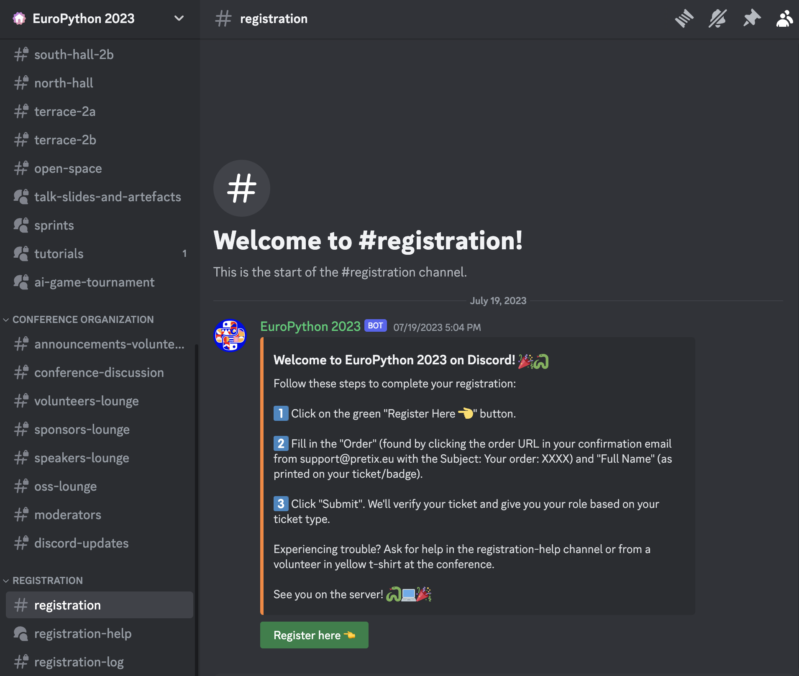

# Discord Bot for PyCon / PyData Conferences

An easy to deploy conference bot that manages roles for attendees via registration, notifies about upcoming sessions.
Exposes Discord server statistics to organizers.
We hosted the bot on Hetzner. And deployed with a single click Action from GitHub 😎.



## Overview

The `main` method in `DiscordBot/bot.py` is the entry point for the bot.
I't a good starting point to start browsing the codebase.
It requires a `.secrets` file in the root of the repository with `DISCORD_BOT_TOKEN` and `PRETIX_TOKEN` environment variables.

### Registration

At PyCon/PyData, we use [pretix](https://pretix.eu/about/en/) as our ticketing system.

The bot utilizes the Pretix API to fetch ticket information and creates an in-memory key-value store to retrieve the ticket type for a given Discord user. The mapping between ticket types and Discord roles is defined in a JSON file, such as ticket_to_roles_prod.json, and is used by the bot to assign roles to users.

There are safeguard methods in place to prevent users from registering multiple times and to make a direct Pretix API call in case the user information is not available in the in-memory store.


### Program notifications

Is a service to push the programme notification to Discord. Pretalx API is used to fetch the programme information, and `config.toml` holds information about livestream URLs.

### Organizers extension
A set of commands that are available only for organizers that are allowing to get statistics about the Discord server.

## Setup
Create `config.local.toml` file in DiscordBot directory, it would be used instead of `config.toml` if exists.

Add `.secrets` file to the root of the repository with the following content:
```shell
DISCORD_BOT_TOKEN=<TestBotToken_from_1Password>
PRETIX_TOKEN=<PretixStagingToken_from_1Password>
````
After you have added the `.secrets` file, you can run the bot with the following command:
```shell
pipenv run python DiscordBot/bot.py
```
or with docker:
```shell
docker build --tag discord_bot .
docker run --interactive --tty --env DISCORD_BOT_TOKEN=$DISCORD_BOT_TOKEN --env PRETIX_TOKEN=$PRETIX_TOKEN discord_bot
```

Create the following files in the root directory manually if you want to run the bot on your machine:
* `registered_log.txt`
* `posted_jobs.txt`

# Pydata deploy notes

As we are not using ansible we need to rely to do some manual stuff on the ssh.

```bash
# create log file
mkdir /home/bot
touch /home/bot/registered_log.txt
```

```bash
mkdir -p /etc/DiscordBot/discord/
touch /etc/DiscordBot/discord/.secrets
# replace ... with the token :)
echo "DISCORD_BOT_TOKEN=..." >  /etc/DiscordBot/discord/.secrets
```

Also add the Discord webhook rooms URLs to the `.secrets` file.

# Credits
Intial fork from [EuroPython Discord Bot](https://github.com/EuroPython/discord).