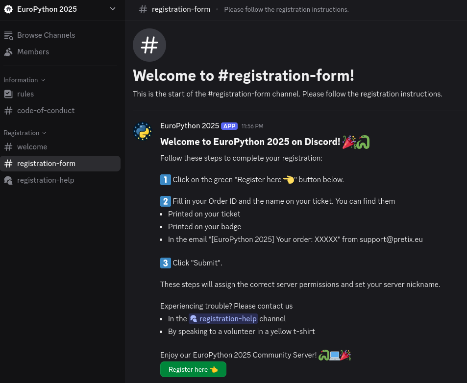
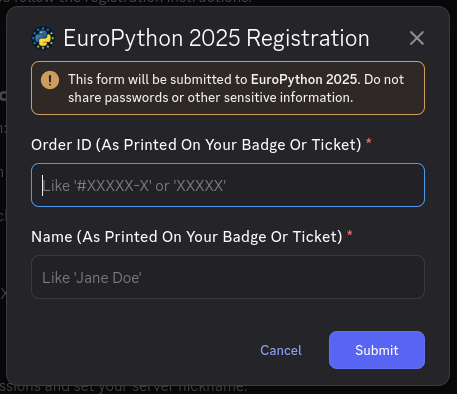
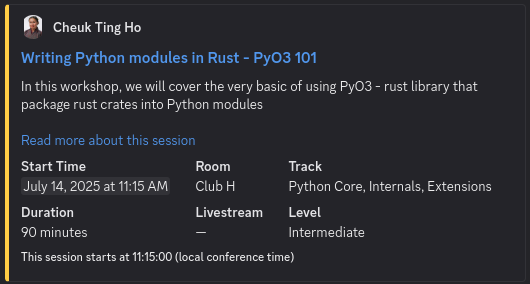

# Europython Discord

A suite of tools for managing the EuroPython Conference Discord server:

* [src/europython_discord](./src/europython_discord): Discord bot
* [scripts/configure-guild.py](./scripts/configure-guild.py): Configure channels and roles of a Discord server
* [scripts/export-members.py](./scripts/export-members.py): Export a list of all server members and their roles
* [scripts/pretix-mock.py](./scripts/pretix-mock.py): Mock Pretix server for development purposes

The scripts work standalone and only require an Auth token. Please find more documentation in the respective files.

The bot has the following extensions ("Cogs"):

* Ping: To check if the bot is running, write `$ping` in any channel. The bot will respond with `Pong!`.
* Guild Statistics: As an organizer, write `$participants` in an organizer-only channel. The bot will respond with a list of roles, and the number of members per role.
* Registration: On startup, the bot posts a registration form. New users must register using their Pretix ticket data. On success, the bot assigns the appropriate roles.
* Programme Notifications: Before each session, the bot posts a session summary and updates the livestream URLs.

## Screenshots
### Registration Channel:


### Registration Form:


### Programme Notification:


## Configuration

All configuration is server-agnostic. You can set up your own Discord server and use the included configuration.

Arguments and environment variables:

* Argument `--config-file`: Path to .toml configuration file
* Environment variable `DISCORD_BOT_TOKEN`: Discord bot auth token (with Admin and `GUILD_MEMBERS` privileges)
* Environment variable `PRETIX_TOKEN`: Pretix access token (preferably read-only)

Included example configuration files:

* [`prod-config.toml`](./prod-config.toml) or [`test-config.toml`](./test-config.toml): Prod/Test configuration
* [`test-livestreams.toml`](./test-livestreams.toml): Test livestream URL configuration

Cache files (will be created if necessary):

* `registered_log.txt`: List of registered users
* `pretix_cache.json`: Local cache of Pretix ticket data
* `schedule_cache.json`: Local cache of [programapi](https://github.com/europython/programapi) schedule

## Usage

This section describes how to install and run the bot.
Please see below for development and EuroPython-specific deployment instructions.

With pip:

```shell
# create and activate virtual environment (optional, but recommended)
python -m venv .venv
. .venv/bin/activate  # Windows: .venv/Scripts/activate

# install this package (use '-e' for 'editable mode' if you plan to modify the code)
pip install .

# set environment variables
export DISCORD_BOT_TOKEN=...  # Windows: $env:DISCORD_BOT_TOKEN = '...'
export PRETIX_TOKEN=...  # Windows: $env:PRETIX_TOKEN = '...'

# run the bot with a given config file
run-bot --config-file your-config-file.toml
```

With uv:

```shell
# install dependencies in virtual environment
uv sync

# set environment variables
export DISCORD_BOT_TOKEN=...  # Windows: $env:DISCORD_BOT_TOKEN = '...'
export PRETIX_TOKEN=...  # Windows: $env:PRETIX_TOKEN = '...'

# run the bot with a given config file
uv run run-bot --config-file your-config-file.toml
```

## Development Setup

NOTE: This project uses [uv](https://docs.astral.sh/uv/) to manage Python versions and dependencies.
  If you don't plan to add/remove/update dependencies, you can also use [pip](https://pip.pypa.io/en/stable/), and any Python version >= 3.11.

### Discord Server and Bot Setup

Follow [Discord Server and Bot Setup](docs/discord-server-bot-setup.md)
if you don't yet have a Bot and Server for developing the bot.

Expected outcome: You have a Discord Bot Token and can run a Discord Bot on a Discord Server.

### Discord Server Configuration

Follow [Discord Server Configuration](docs/discord-server-configuration.md)
to configure your existing Discord Server with the expected channels, roles and messages.

Expected outcome: A Discord Server ready to be used for this bot.

### Pretix Integration

This bot connects to a Pretix instance to obtain a list of valid tickets.

Follow [Pretix Client Setup](docs/pretix-client-setup.md) to either connect to a real Pretix instance,
or to use a mock.

### Python environment setup

* Using `uv`
    * Install `uv` as documented [here](https://docs.astral.sh/uv/getting-started/installation/)
    * Activate virtual environment: `. .venv/bin/activate` (macOS, Linux) or `.venv/Scripts/activate` (Windows)
    * Run `uv sync --dev` to create/update a virtual environment with all dependencies according to [uv.lock](./uv.lock).
* Using `pip`
    * Create a virtual environment: `python3 -m venv .venv` (might require `apt install python3-venv` or similar on some systems)
    * Activate virtual environment: `. .venv/bin/activate` (macOS, Linux) or `.venv/Scripts/activate` (Windows)
    * Ensure `pip` version is >= 25.1.0: `python3 -m pip install --upgrade pip` (earlier versions don't support [PEP 735](https://peps.python.org/pep-0735/) Dependency Groups)
    * Install all dependencies according to [pyproject.toml](pyproject.toml): `python3 -m pip install -e . --group dev`
* Run `pre-commit install` to install the [pre-commit](https://pre-commit.com/) hooks.
* Run `pre-commit run --all-files` to verify your setup. All checks should pass.

### Run the bot

To run the bot, use the following:

```shell
# set environment variables
export DISCORD_BOT_TOKEN=...  # Windows: $env:DISCORD_BOT_TOKEN = '...'
export PRETIX_TOKEN=...  # Windows: $env:PRETIX_TOKEN = '...'

# run the bot with a given config file
run-bot --config your-config-file.toml
```

### Working with `uv`

This is a list of useful commands when working with `uv`.
Please refer to the [uv documentation](https://docs.astral.sh/uv) or `uv help` for details.

```shell
# activate uv-generated virtual environment ("venv")
. .venv/bin/activate  # Windows: '.venv/Scripts/activate'

# create/synchronize venv based on uv.lock file
uv sync
uv sync --dev  # include dev dependencies

# execute command inside uv-generated venv (can be skipped if venv is activated)
uv run [command]

# add package
uv add [package]
uv add --dev [package]  # as dev dependency

# upgrade packages
uv lock --upgrade

# remove package
uv remove [package]
```

### Development tools

* Run everything: `pre-commit run --all-files`
* Format code: `ruff format`
* Check code format: `ruff format --check`
* Fix imports: `ruff check --select I001,F401 --fix`
* Check code style: `ruff check .`
* Run tests: `pytest`

## Deployment

For the EuroPython conference, this bot is deployed on a VPS.
It uses Ansible to configure the VPS, and Docker Compose to run the bot.
The deployment process is executed via a GitHub Action.

Related files:

* In this repository:
    * [.github/workflows/deploy.yml](./.github/workflows/deploy.yml): GitHub Action
    * [ansible/deploy-playbook.yml](./ansible/deploy-playbook.yml): Ansible Playbook
    * [Dockerfile](./Dockerfile): Docker container recipe
    * [compose.yaml](./compose.yaml): Docker Compose recipe
    * [prod-config.toml](./prod-config.toml): Prod bot configuration
* On the VPS:
    * NOTE: Read-only files are in `/root`, Cache files created by the bot are in `/home/bot`
    * `/root/.secrets`: Contains `DISCORD_BOT_TOKEN` and `PRETIX_TOKEN`
    * `/root/livestreams.toml`: Livestream URL configuration
    * `/home/bot/registered_log.txt`: Registration log
    * `/home/bot/pretix_cache.json`: Pretix cache
    * `/home/bot/schedule_cache.json`: Program cache
