# Discord Server and Bot Setup

Follow this guide to

* Create a Discord Server
* Create a Discord Bot
* Connect the Bot to the Server

NOTE: These steps require a Discord account with two-factor authentication enabled.

## Create the Server

In the left sidebar of the Discord Window, click the button "Add a Server":


Select "Create My Own":

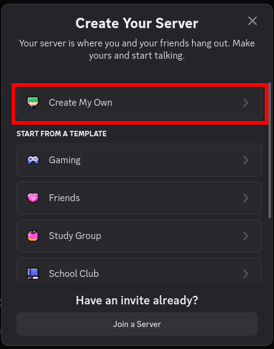

Skip further questions:

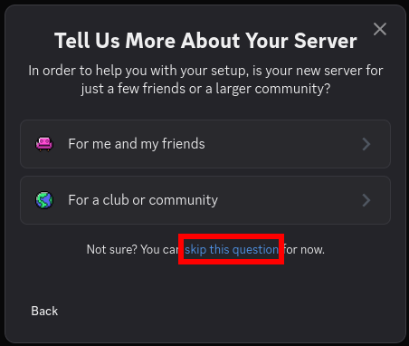

Configure the server name and icon (can be updated later), then click "Create":

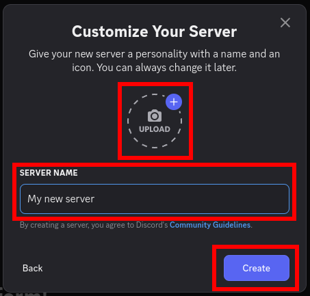

Congratulations, you now have your own Discord server.

## Create a Bot

Go to https://discord.com/developers/applications/ and log in.

In the top-right corner, click "New Application".


Configure the application name (can be updated later), agree to the terms of service, and click "Create".

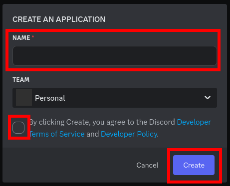

In the left sidebar, go to "General Information" and configure the bot's icon and description (optional, can be updated later).

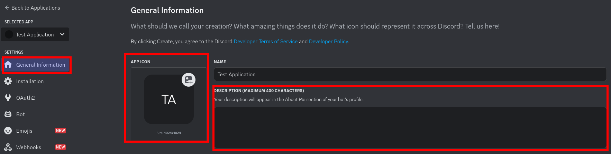

Scroll down and configure the Terms of Service and Privacy Policy (optional, can be updated later).

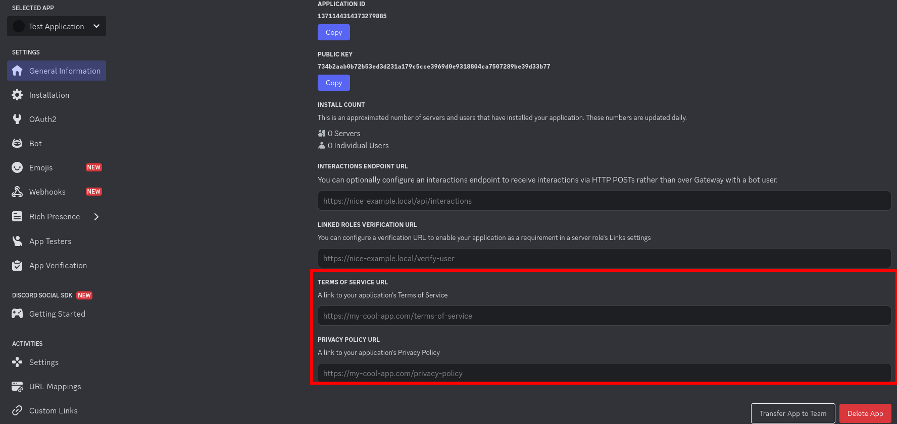

In the left sidebar, go to "Installation".
Remove the option "User install" and set the Install Link to "None".

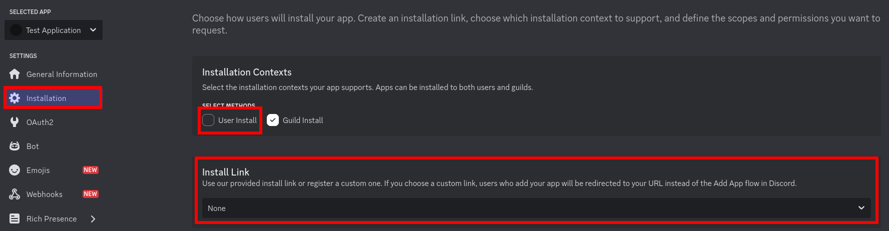

In the left sidebar, go to "Bot", then scroll down to "Privileged Gateway Intents".
Activate "Server Member Intent" and "Message Content Intent".
Click "Save Changes".

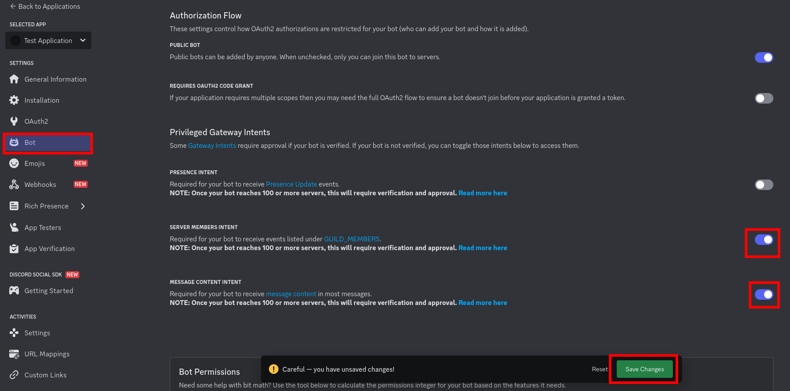

In the left sidebar, go to "OAuth2".
Select the scope "bot" and the permission "Administrator".

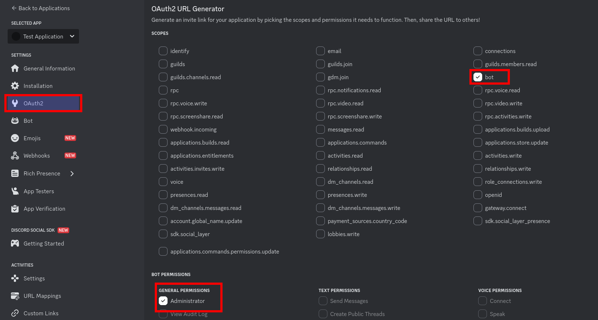

Scroll down, configure the integration type "Guild Install", and copy the URL.

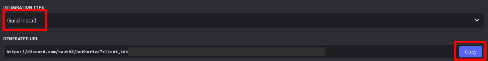

Open the copied URL in a web browser. You will be prompted to open the Discord app.

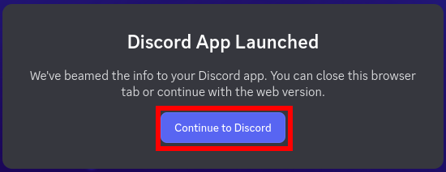

Proceed to add the bot to your server.

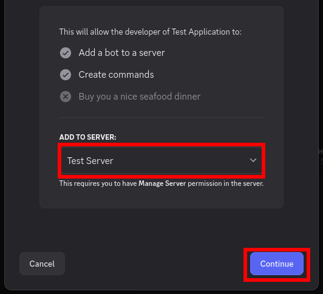

Confirm the assigned permissions.

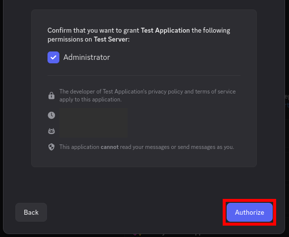

Congratulations, you created a bot and added it to a server.

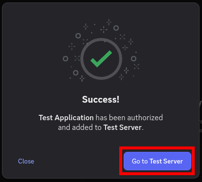

## Use the Bot

To use the bot from Python, you need an authorization token.

Go back to https://discord.com/developers/applications/.
In the left sidebar, go to "Bot", and click "Reset Token".

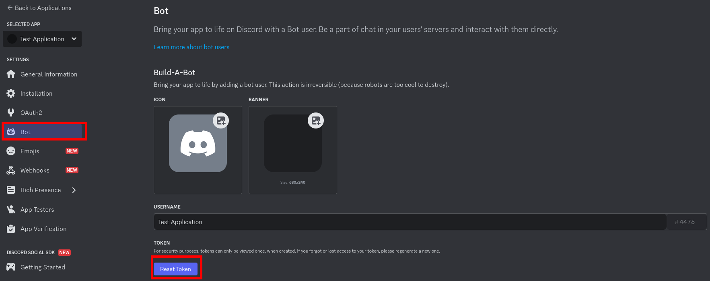

Confirm that step. This might require a two-factor authentication confirmation.

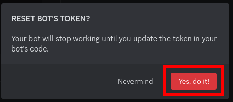

Copy your new token and store it somewhere safe.

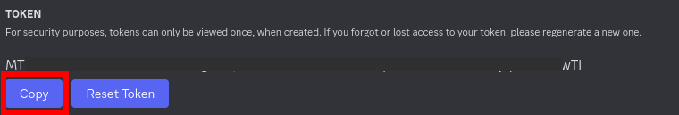

To confirm the installation, install the Python package [discord.py](https://pypi.org/project/discord.py/)
(e.g. with `pip install discord.py`), and run the following script (add your bot token at `BOT_TOKEN = "..."`):

```python
import asyncio

import discord
from discord.ext import commands

BOT_TOKEN = "..."


class Bot(commands.Bot):
    async def on_ready(self):
        print("ready", self.user.name, self.user.id)


class Ping(commands.Cog):
    @commands.hybrid_command(name="ping")
    async def ping(self, context):
        await context.send("Pong!")


async def main():
    prefix = commands.when_mentioned_or("$")

    intents = discord.Intents(messages=True, message_content=True)
    async with Bot(command_prefix=prefix, intents=intents) as bot:
        await bot.add_cog(Ping())
        await bot.start(BOT_TOKEN)


if __name__ == "__main__":
    asyncio.run(main())
```

In Discord, go to your server and write the message `$ping` in a text channel.
The bot should respond with `Pong!`.

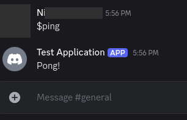

You can now stop the Python script by pressing Ctrl+C.
