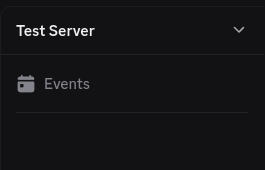

# Discord Server Configuration

Follow this guide to configure an existing Discord Server.

NOTE: This guide requires you to run a Discord Bot on the Discord Server.

## Remove Current Configuration (optional)

If you are starting with a fresh Discord Server, it is recommended to delete all existing channels
and categories.

To delete a channel or category, right-click it, then left-click the "Delete" option.


Repeat this step until the server is empty.



NOTE: If you skip this step, the configuration script will still work and will not delete anything.

Ensure that [discord.py](https://pypi.org/project/discord.py/) and [pydantic](https://pypi.org/project/pydantic) are installed.
Set the environment variable `BOT_TOKEN` to your authorization token,
then run the script [scripts/configure-guild.py](/scripts/configure-guild.py).

```shell
# macOS, Linux:
export BOT_TOKEN="..."

# Windows:
$env:BOT_TOKEN = '...'

python scripts/configure-guild.py --verbose
```

Your server should now be fully configured.


